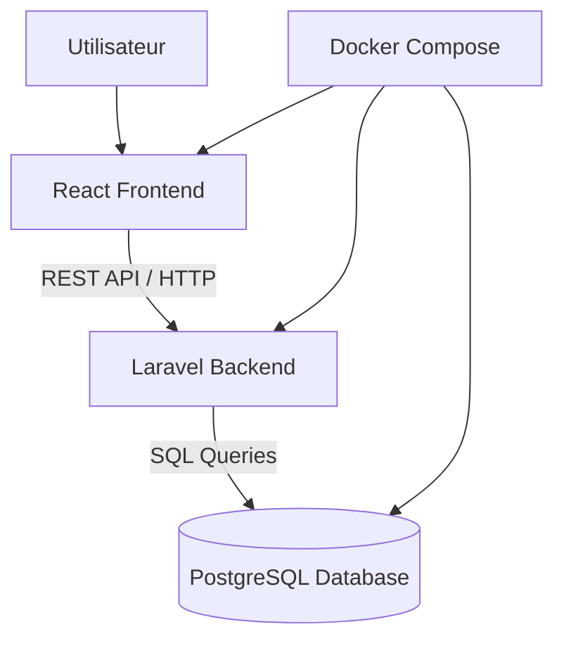

# Architecture Technique — Gestion Tournois

## 1. Objectif

Ce document présente l'architecture technique de l'application Gestion Tournois.

L'application suit une architecture web moderne basée sur :

- un frontend React
- un backend Laravel
- une base de données PostgreSQL
- une communication via API REST
- un environnement local Docker Compose

## 2. Architecture générale

```txt
Utilisateur
    |
    v
React Frontend
    |
    | HTTP / REST API
    v
Laravel Backend
    |
    | SQL
    v
PostgreSQL Database
```

## 3. Diagramme d'architecture



## 4. Services Docker

Le projet est lancé avec une seule commande :

```bash
docker compose up -d --build
```

Cette commande lance les services suivants :

| Service | Container | Port |
|---|---|---|
| frontend | gt-frontend | 5173 |
| backend | gt-backend | 8000 |
| postgres | gt-postgres | 5433 sur Windows / 5432 dans Docker |

## 5. Communication entre les services

### Frontend vers Backend

Le frontend React communique avec Laravel via des requêtes HTTP vers l'API REST.

Exemple :

```txt
GET /api/teams
POST /api/players
PUT /api/matches/{id}
DELETE /api/seasons/{id}
```

### Backend vers Base de données

Laravel communique avec PostgreSQL avec cette configuration Docker :

```env
DB_CONNECTION=pgsql
DB_HOST=postgres
DB_PORT=5432
DB_DATABASE=gestion_tournois
DB_USERNAME=postgres
DB_PASSWORD=postgres
```

## 6. Stockage des images

Les images uploadées sont stockées dans Laravel :

```txt
backend/storage/app/public
```

La base de données stocke seulement le chemin de l'image.

Exemples :

```txt
teams/logo.png
players/photo.jpg
tournaments/banner.jpg
```

## 7. Avantages de cette architecture

- Séparation claire entre frontend et backend.
- API REST réutilisable.
- Base de données PostgreSQL robuste.
- Lancement simple avec Docker Compose.
- Environnement identique pour les membres de l'équipe.
- Maintenance plus facile.