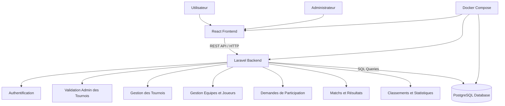

# Architecture Technique — Tournify (Gestion Tournois Locaux)

**Version :** 1.2 — Juillet 2026

## 1. Objectif

Ce document présente l'architecture technique de l'application **Tournify** (*Gestion Tournois Locaux*).

L'application suit une architecture web moderne basée sur :

- un frontend React ;
- un backend Laravel ;
- une base de données PostgreSQL ;
- une communication via API REST ;
- un environnement local Docker Compose.

## 2. Architecture générale

```txt
Utilisateur
    |
    v
React Frontend
    |
    | HTTP / REST API
    v
Laravel Backend
    |
    | SQL
    v
PostgreSQL Database
```

## 3. Diagramme d'architecture



## 4. Services Docker

Le projet est lancé avec une seule commande :

```bash
docker compose up -d --build
```

| Service | Container | Port |
|---|---|---|
| frontend | gt-frontend | 5173 |
| backend | gt-backend | 8000 |
| postgres | gt-postgres | 5433 sur Windows / 5432 dans Docker |

## 5. Communication entre les services

### Frontend vers Backend

Le frontend React communique avec Laravel via des requêtes HTTP vers l'API REST.

Exemples :

```txt
POST /api/register
POST /api/login
GET /api/tournaments
POST /api/tournaments
GET /api/admin/tournaments/pending
PUT /api/admin/tournaments/{id}/accept
PUT /api/admin/tournaments/{id}/refuse
POST /api/teams
POST /api/players
POST /api/join-requests
PUT /api/join-requests/{id}/accept
POST /api/matches
PUT /api/matches/{id}/result
GET /api/rankings?tournament_id=1
```

### Backend vers Base de données

Laravel communique avec PostgreSQL avec cette configuration Docker :

```env
DB_CONNECTION=pgsql
DB_HOST=postgres
DB_PORT=5432
DB_DATABASE=gestion_tournois
DB_USERNAME=postgres
DB_PASSWORD=postgres
```

## 6. Modules principaux

### 6.1 Authentification

Gestion de l'inscription, de la connexion et des permissions de base.

### 6.2 Validation admin

L'admin accepte ou refuse les tournois créés par les utilisateurs.

### 6.3 Gestion des tournois

Création, modification, consultation et suivi des tournois locaux.

### 6.4 Gestion des équipes et joueurs

Création des équipes et ajout des joueurs.

### 6.5 Demandes de participation

Une équipe demande à rejoindre un tournoi accepté.

### 6.6 Matchs et résultats

Planification des matchs et saisie des scores.

### 6.7 Classements et statistiques

Calcul automatique des points et suivi des statistiques sportives.

## 7. Stockage des images

Les images uploadées sont stockées dans Laravel :

```txt
backend/storage/app/public
```

La base de données stocke seulement le chemin.

Exemples :

```txt
teams/logo.png
players/photo.jpg
tournaments/banner.jpg
```

Commande Laravel :

```bash
php artisan storage:link
```

Avec Docker :

```bash
docker compose exec backend php artisan storage:link
```

## 8. Avantages de cette architecture

- Séparation claire entre frontend et backend.
- API REST réutilisable.
- Base de données PostgreSQL robuste.
- Lancement simple avec Docker Compose.
- Environnement identique pour les membres de l'équipe.
- Maintenance plus facile.
- Fonctionnalités adaptées au périmètre PFE.
