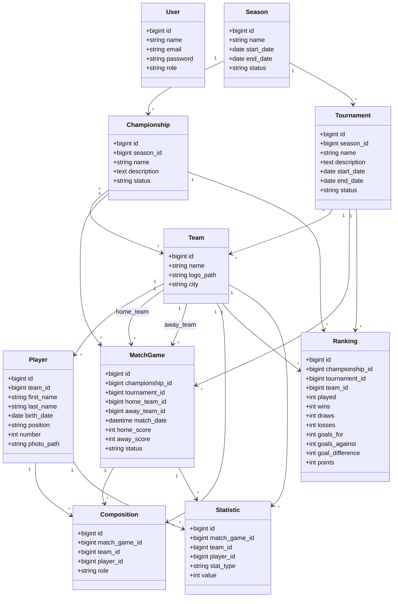

# Diagramme de Classes — Gestion Tournois

## 1. Objectif

Ce document présente les principales classes du système et leurs relations.

## 2. Classes principales

- User
- Season
- Championship
- Tournament
- Team
- Player
- MatchGame
- Composition
- Ranking
- Statistic

## 3. Diagramme de classes

## 4. Remarque importante

Le modèle `MatchGame` est utilisé au lieu de `Match`, car `match` est un mot réservé en PHP.