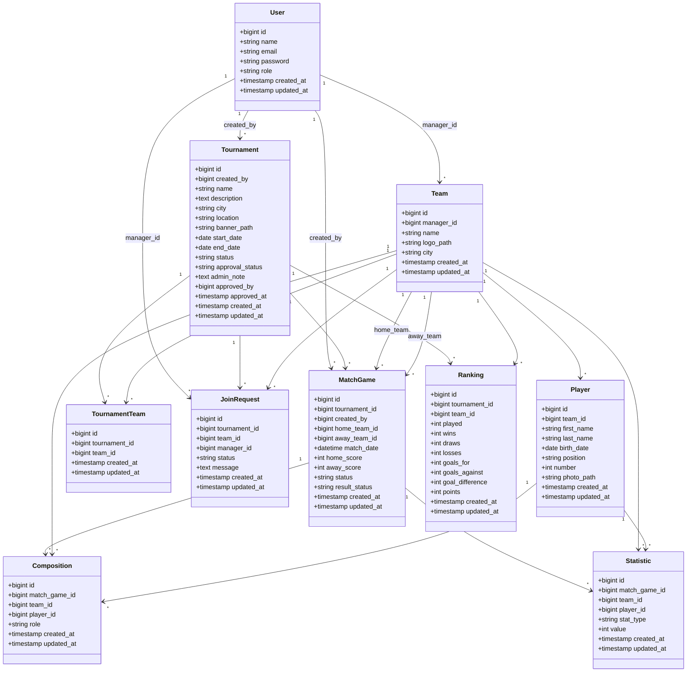

# Diagramme de Classes — Gestion Tournois Locaux

## 1. Objectif

Ce document présente les principales classes du système **Gestion Tournois Locaux** ainsi que leurs relations.

La conception est simplifiée : pas de championnats, pas de compétitions officielles et pas de paiement simulé.

## 2. Classes principales

- User
- Tournament
- Team
- Player
- MatchGame
- Composition
- Ranking
- Statistic
- JoinRequest
- TournamentTeam

## 3. Diagramme de classes

## 4. Remarques de conception

- `User.role` contient seulement `admin` ou `user`.
- `Tournament.created_by` permet de savoir qui est responsable du tournoi.
- `Tournament.approval_status` permet à l'admin d'accepter ou refuser un tournoi.
- `Tournament.status` représente l'état sportif du tournoi.
- `JoinRequest` permet à une équipe de demander la participation.
- `TournamentTeam` contient uniquement les équipes acceptées.
- `MatchGame.result_status` permet de gérer la validation des résultats.
- `Ranking` dépend uniquement de `tournament_id`.
