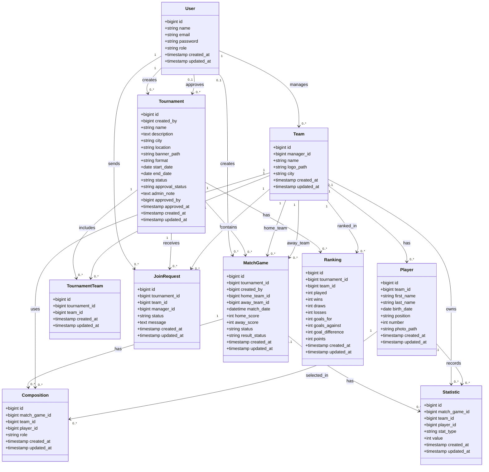

# Diagramme de Classes — Gestion Tournois Locaux

## 1. Objectif

Ce document présente les principales classes du système **Gestion Tournois Locaux** ainsi que leurs relations.

La conception est simplifiée : pas de championnats, pas de compétitions officielles et pas de paiement simulé.

## 2. Classes principales

- User
- Tournament
- Team
- Player
- MatchGame
- Composition
- Ranking
- Statistic
- JoinRequest
- TournamentTeam

## 3. Diagramme de classes



## 4. Remarques de conception

- `User.role` contient seulement `admin` ou `user`.
- `Tournament.created_by` permet de savoir quel utilisateur a créé le tournoi.
- `Tournament.approved_by` est optionnel : il reste vide tant que le tournoi est en attente.
- `Tournament.approval_status` permet à l'admin d'accepter ou refuser un tournoi.
- `Tournament.status` représente l'état sportif du tournoi : `draft`, `open`, `active`, `finished` ou `cancelled`.
- `Tournament.format` est fixé à `league` (championnat local avec classement).
- `JoinRequest` permet à une équipe de demander la participation à un tournoi.
- `TournamentTeam` est la table pivot qui contient uniquement les équipes acceptées dans un tournoi.
- `MatchGame.home_team_id` et `MatchGame.away_team_id` représentent deux relations différentes vers `Team`.
- `Composition` appartient à un match, une équipe et un joueur.
- `Statistic` appartient directement à `MatchGame`, `Team` et `Player`.
- Il n'y a pas de relation directe entre `Composition` et `Statistic`.
- `Ranking` dépend de `tournament_id` et `team_id`.

## 5. Contraintes importantes à respecter

```txt
home_team_id != away_team_id
home_team_id et away_team_id doivent exister dans tournament_team pour le tournoi concerné
player_id dans Composition doit appartenir à team_id
tournament_team doit être unique par tournament_id + team_id
rankings doit être unique par tournament_id + team_id
join_requests doit éviter les doublons par tournament_id + team_id
```
