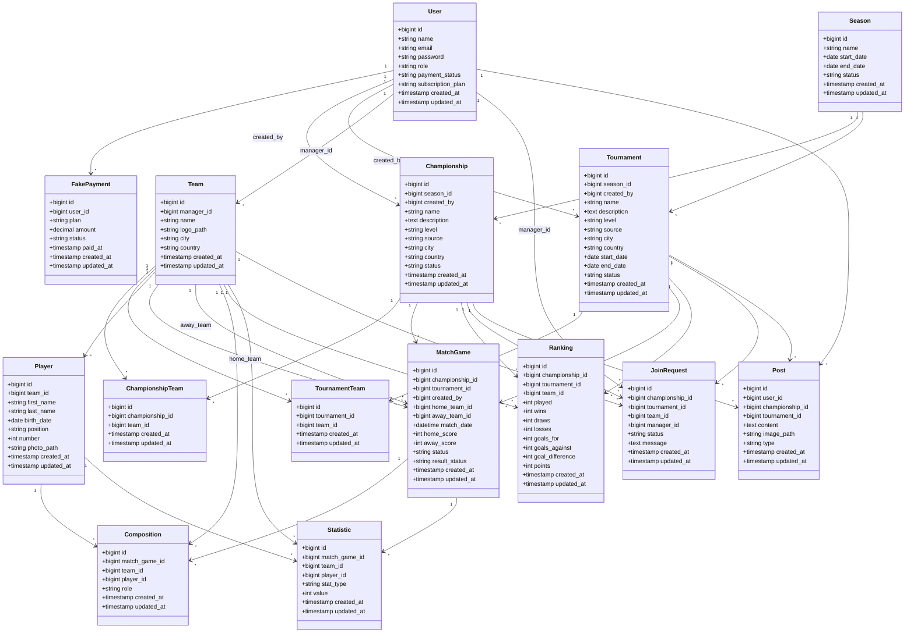

# Diagramme de Classes — Gestion Tournois

## 1. Objectif

Ce document présente les principales classes du système Gestion Tournois ainsi que leurs relations.

L'application permet de gérer les compétitions officielles, les compétitions locales, les équipes, les joueurs, les matchs, les compositions, les classements, les statistiques, les demandes de participation, les paiements simulés et les publications.

---

## 2. Classes principales

- User
- FakePayment
- Season
- Championship
- Tournament
- Team
- Player
- MatchGame
- Composition
- Ranking
- Statistic
- JoinRequest
- Post
- ChampionshipTeam
- TournamentTeam

---

## 3. Diagramme de classes

---

## 4. Remarques de conception

- `User.role` définit les permissions principales : admin, organizer, team_manager, viewer.
- `Championship.level` et `Tournament.level` permettent de distinguer une compétition internationale, nationale ou locale.
- `Championship.source` et `Tournament.source` permettent de distinguer une compétition officielle d'une compétition créée par un utilisateur.
- `MatchGame.result_status` permet de gérer la validation des résultats locaux.
- `JoinRequest` permet à un team manager de demander la participation de son équipe à une compétition locale.
- `FakePayment` simule l'abonnement organizer dans le prototype.
- `Post` représente le feed social football simple.
