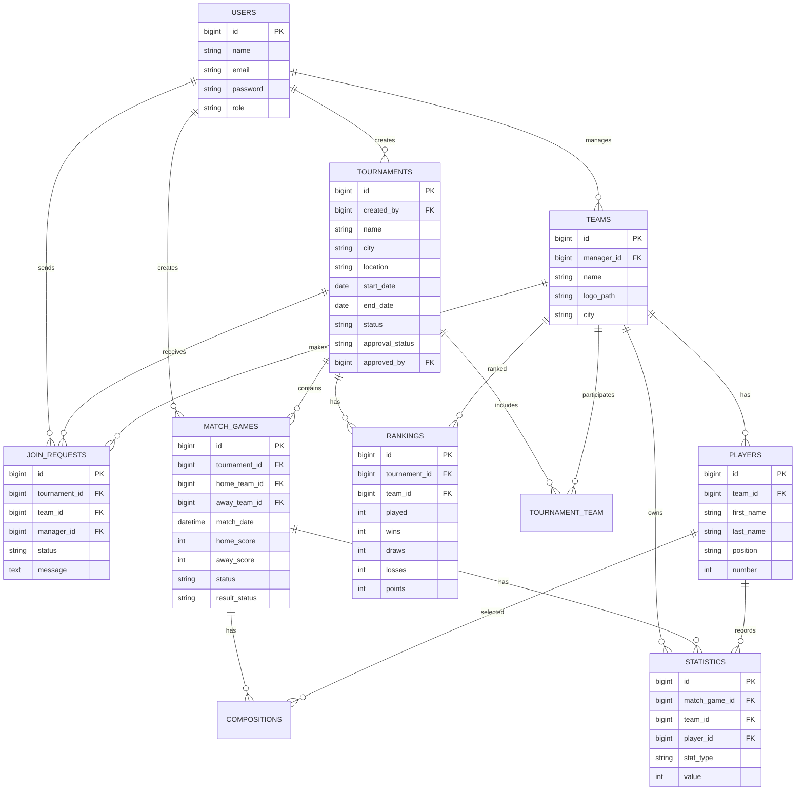

# Schéma de Base de Données — Gestion Tournois Locaux

## 1. Objectif

Ce document définit le schéma de base de données de l'application **Gestion Tournois Locaux**.

La base de données utilisée est **PostgreSQL**.

L'application gère uniquement des tournois locaux. Les tables liées aux championnats et aux paiements simulés ne sont plus nécessaires.

## 2. Tables principales

### users

Table des utilisateurs de l'application.

| Champ | Type | Description |
|---|---|---|
| id | bigint | Clé primaire |
| name | string | Nom de l'utilisateur |
| email | string | Email unique |
| password | string | Mot de passe hashé |
| role | string | admin ou user |
| created_at | timestamp | Date de création |
| updated_at | timestamp | Date de modification |

### tournaments

Table des tournois locaux.

| Champ | Type | Description |
|---|---|---|
| id | bigint | Clé primaire |
| created_by | bigint | Clé étrangère vers users |
| name | string | Nom du tournoi |
| description | text nullable | Description |
| city | string nullable | Ville |
| location | string nullable | Lieu exact |
| banner_path | string nullable | Image du tournoi |
| start_date | date | Date de début |
| end_date | date | Date de fin |
| status | string | draft, open, active, finished, cancelled |
| approval_status | string | pending, accepted, refused |
| admin_note | text nullable | Note de l'admin en cas de refus |
| approved_by | bigint nullable | Admin qui a accepté/refusé |
| approved_at | timestamp nullable | Date de validation |
| created_at | timestamp | Date de création |
| updated_at | timestamp | Date de modification |

Règles :

```txt
created_by = utilisateur qui a créé le tournoi
approval_status = validation admin
status = progression sportive du tournoi
```

### teams

Table des équipes.

| Champ | Type | Description |
|---|---|---|
| id | bigint | Clé primaire |
| manager_id | bigint | Clé étrangère vers users |
| name | string | Nom de l'équipe |
| logo_path | string nullable | Chemin du logo |
| city | string nullable | Ville |
| created_at | timestamp | Date de création |
| updated_at | timestamp | Date de modification |

### players

Table des joueurs.

| Champ | Type | Description |
|---|---|---|
| id | bigint | Clé primaire |
| team_id | bigint | Clé étrangère vers teams |
| first_name | string | Prénom |
| last_name | string | Nom |
| birth_date | date nullable | Date de naissance |
| position | string nullable | Poste du joueur |
| number | integer nullable | Numéro du joueur |
| photo_path | string nullable | Chemin de la photo |
| created_at | timestamp | Date de création |
| updated_at | timestamp | Date de modification |

### tournament_team

Table pivot entre les tournois et les équipes acceptées.

| Champ | Type | Description |
|---|---|---|
| id | bigint | Clé primaire |
| tournament_id | bigint | Clé étrangère vers tournaments |
| team_id | bigint | Clé étrangère vers teams |
| created_at | timestamp | Date de création |
| updated_at | timestamp | Date de modification |

### join_requests

Table des demandes de participation.

| Champ | Type | Description |
|---|---|---|
| id | bigint | Clé primaire |
| tournament_id | bigint | Clé étrangère vers tournaments |
| team_id | bigint | Clé étrangère vers teams |
| manager_id | bigint | Clé étrangère vers users |
| status | string | pending, accepted, refused |
| message | text nullable | Message optionnel |
| created_at | timestamp | Date de création |
| updated_at | timestamp | Date de modification |

Règle : lorsqu'une demande est acceptée, l'équipe est ajoutée à la table `tournament_team`.

### match_games

Table des matchs.

Important : le nom `match` ne doit pas être utilisé car `match` est un mot réservé en PHP. Le modèle recommandé est `MatchGame`.

| Champ | Type | Description |
|---|---|---|
| id | bigint | Clé primaire |
| tournament_id | bigint | Clé étrangère vers tournaments |
| created_by | bigint nullable | Utilisateur qui a créé le match |
| home_team_id | bigint | Équipe domicile |
| away_team_id | bigint | Équipe extérieure |
| match_date | datetime | Date et heure du match |
| home_score | integer nullable | Score équipe domicile |
| away_score | integer nullable | Score équipe extérieure |
| status | string | scheduled, played, cancelled |
| result_status | string | pending, confirmed, disputed |
| created_at | timestamp | Date de création |
| updated_at | timestamp | Date de modification |

### compositions

Table des compositions d'équipes pour chaque match.

| Champ | Type | Description |
|---|---|---|
| id | bigint | Clé primaire |
| match_game_id | bigint | Clé étrangère vers match_games |
| team_id | bigint | Clé étrangère vers teams |
| player_id | bigint | Clé étrangère vers players |
| role | string | starter, substitute |
| created_at | timestamp | Date de création |
| updated_at | timestamp | Date de modification |

### rankings

Table des classements.

| Champ | Type | Description |
|---|---|---|
| id | bigint | Clé primaire |
| tournament_id | bigint | Clé étrangère vers tournaments |
| team_id | bigint | Clé étrangère vers teams |
| played | integer | Matchs joués |
| wins | integer | Victoires |
| draws | integer | Matchs nuls |
| losses | integer | Défaites |
| goals_for | integer | Buts marqués |
| goals_against | integer | Buts encaissés |
| goal_difference | integer | Différence de buts |
| points | integer | Points |
| created_at | timestamp | Date de création |
| updated_at | timestamp | Date de modification |

### statistics

Table des statistiques.

| Champ | Type | Description |
|---|---|---|
| id | bigint | Clé primaire |
| match_game_id | bigint nullable | Clé étrangère vers match_games |
| team_id | bigint nullable | Clé étrangère vers teams |
| player_id | bigint nullable | Clé étrangère vers players |
| stat_type | string | goal, assist, yellow_card, red_card, clean_sheet |
| value | integer | Valeur statistique |
| created_at | timestamp | Date de création |
| updated_at | timestamp | Date de modification |

## 3. Relations principales

```txt
User 1 ---- * Tournament : created_by
User 1 ---- * Team : manager_id
User 1 ---- * JoinRequest : manager_id
User 1 ---- * MatchGame : created_by

Tournament * ---- * Team : tournament_team
Tournament 1 ---- * JoinRequest
Tournament 1 ---- * MatchGame
Tournament 1 ---- * Ranking

Team 1 ---- * Player
Team 1 ---- * JoinRequest
Team 1 ---- * Ranking
Team 1 ---- * Statistic

MatchGame * ---- 1 Home Team
MatchGame * ---- 1 Away Team
MatchGame 1 ---- * Composition
MatchGame 1 ---- * Statistic

Player 1 ---- * Composition
Player 1 ---- * Statistic
```

## 4. Diagramme ERD



## 5. Règles de classement

```txt
Victoire = 3 points
Match nul = 1 point
Défaite = 0 point
```

Le classement est trié par :

1. points ;
2. différence de buts ;
3. buts marqués ;
4. nom de l'équipe.

Règle importante :

```txt
Seuls les matchs avec result_status = confirmed sont utilisés dans le calcul du classement.
```

## 6. Tables supprimées de la nouvelle conception

Les tables suivantes ne sont plus nécessaires dans la nouvelle version :

```txt
championships
championship_team
fake_payments
```

Les champs suivants ne sont plus nécessaires :

```txt
payment_status
subscription_plan
championship_id
level
source
```
