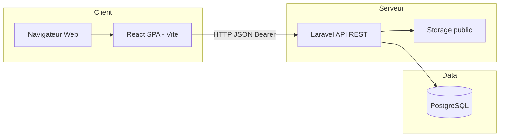
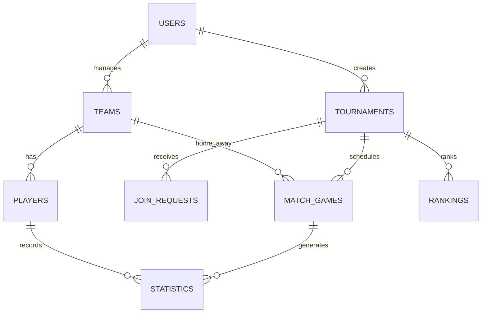
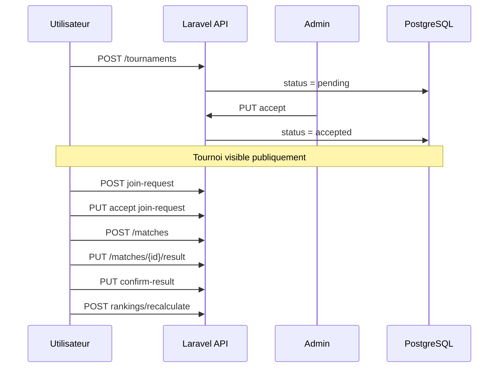

# Documentation Technique — Tournify (Gestion Tournois Locaux)

**Version :** 1.2 — Juillet 2026  
**Projet de Fin d'Études** — Application web de gestion de tournois locaux de football

---

## 1. Introduction

### 1.1 Contexte

**Tournify** (nom commercial du projet *Gestion Tournois Locaux*) est une plateforme web permettant à un utilisateur de proposer un tournoi local, soumis à validation par un administrateur. Une fois accepté, le tournoi devient public : les équipes demandent leur participation, le créateur planifie les matchs, saisit les scores et consulte le classement et les statistiques.

### 1.2 Périmètre fonctionnel

| Inclus | Exclus |
|---|---|
| Tournois locaux | Championnats nationaux |
| Validation admin | Paiements en ligne |
| Équipes et joueurs | Compétitions officielles (Botola, UCL…) |
| Matchs et résultats | Rôles organizer/viewer legacy |
| Classements et stats | |

### 1.3 Acteurs

| Acteur | Description |
|---|---|
| **Visiteur** | Consulte landing, tournois publics, classements |
| **Utilisateur (user)** | Crée tournois, équipes, joueurs ; demande participation |
| **Créateur de tournoi** | Sous-ensemble user : gère *ses* tournois acceptés |
| **Administrateur** | Valide/refuse tournois ; supervise la plateforme |

---

## 2. Architecture technique

### 2.1 Vue d'ensemble



### 2.2 Stack

| Composant | Technologie | Version indicatif |
|---|---|---|
| Frontend | React + TypeScript + Vite | React 19 |
| Styles | Tailwind CSS + tokens thème | — |
| Graphiques | ApexCharts | react-apexcharts |
| Backend | Laravel | 11.x |
| ORM | Eloquent | — |
| Auth API | Laravel Sanctum | Token Bearer |
| BDD | PostgreSQL | 15+ |
| Conteneurs | Docker Compose | 3 services |

### 2.3 Services Docker

| Service | Conteneur | Port hôte |
|---|---|---|
| frontend | gt-frontend | 5173 |
| backend | gt-backend | 8000 |
| postgres | gt-postgres | 5433 (Windows) |

Commande :

```bash
docker compose up -d --build
```

---

## 3. Structure du dépôt

```txt
gestion-tournois/
├── backend/
│   ├── app/
│   │   ├── Http/Controllers/Api/    # Contrôleurs REST
│   │   ├── Models/                  # Modèles Eloquent
│   │   └── Policies/                # Autorisations
│   ├── database/migrations/         # Schéma PostgreSQL
│   ├── routes/api.php               # Routes API
│   └── storage/app/public/          # Fichiers uploadés
├── frontend/
│   └── src/
│       ├── api.ts                   # Client HTTP centralisé
│       ├── pages/                   # Pages par domaine
│       ├── components/              # Composants réutilisables
│       ├── context/                   # Auth, thème
│       └── utils/permissions.ts       # Règles frontend
└── docs/                            # Livrables PFE
```

---

## 4. Modèle de données

### 4.1 Tables principales

| Table | Rôle |
|---|---|
| `users` | Comptes (role: admin \| user) |
| `tournaments` | Tournois (status: pending \| accepted \| refused \| …) |
| `teams` | Équipes (manager_id → user) |
| `players` | Joueurs liés à une équipe |
| `tournament_team` | Équipes inscrites à un tournoi |
| `join_requests` | Demandes de participation |
| `match_games` | Matchs (scores, result_status) |
| `compositions` | Feuilles de match |
| `rankings` | Classement calculé par tournoi |
| `statistics` | Stats individuelles (buts, cartons…) |

### 4.2 Diagramme entité-relation (simplifié)



### 4.3 États métier importants

**Tournoi :** `pending` → validation admin → `accepted` | `refused`

**Résultat match (`result_status`) :**

```txt
pending → confirmed | disputed
```

Seuls les résultats **confirmés** alimentent le classement.

---

## 5. API REST

Base URL : `http://localhost:8000/api`

Authentification : en-tête `Authorization: Bearer {token}`

### 5.1 Authentification

| Méthode | Route | Description |
|---|---|---|
| POST | `/register` | Inscription |
| POST | `/login` | Connexion → token |
| POST | `/logout` | Déconnexion |
| GET | `/user` | Profil connecté |

### 5.2 Tournois

| Méthode | Route | Description |
|---|---|---|
| GET | `/tournaments` | Tournois publics (acceptés) |
| GET | `/my-tournaments` | Mes tournois |
| POST | `/tournaments` | Créer (→ pending) |
| PUT | `/tournaments/{id}` | Modifier (propriétaire) |
| DELETE | `/tournaments/{id}` | Supprimer |

### 5.3 Admin

| Méthode | Route | Description |
|---|---|---|
| GET | `/admin/tournaments/pending` | En attente |
| PUT | `/admin/tournaments/{id}/accept` | Accepter |
| PUT | `/admin/tournaments/{id}/refuse` | Refuser |

### 5.4 Équipes et joueurs

| Méthode | Route | Description |
|---|---|---|
| GET/POST | `/teams`, `/my-teams` | CRUD équipes |
| GET/POST | `/players` | CRUD joueurs |

### 5.5 Matchs

| Méthode | Route | Description |
|---|---|---|
| GET/POST | `/matches` | Liste / création |
| PUT | `/matches/{id}` | Modifier date/équipes |
| PUT | `/matches/{id}/result` | Saisir score |
| PUT | `/matches/{id}/confirm-result` | Confirmer |
| PUT | `/matches/{id}/dispute-result` | Contester |

### 5.6 Classements et statistiques

| Méthode | Route | Description |
|---|---|---|
| GET | `/rankings?tournament_id=` | Classement |
| POST | `/rankings/recalculate` | Recalcul |
| GET/POST | `/statistics` | Stats CRUD |

### 5.7 Dashboard

| Méthode | Route | Description |
|---|---|---|
| GET | `/dashboard/summary` | Agrégats, graphiques, aperçus |

---

## 6. Frontend React

### 6.1 Organisation des pages

| Route | Page | Accès |
|---|---|---|
| `/` | Landing | Public |
| `/login`, `/register` | Auth | Public |
| `/dashboard` | Tableau de bord | Auth |
| `/tournaments` | Liste tournois | Auth / public partiel |
| `/teams`, `/players` | Gestion effectifs | Auth |
| `/matches` | Matchs et résultats | Auth |
| `/rankings` | Classements | Public lecture |
| `/statistics` | Statistiques | Auth |
| `/admin/*` | Espace admin | Admin |

### 6.2 Composants clés

| Composant | Rôle |
|---|---|
| `MatchRowList` | Lignes match (dashboard, page matchs, détail tournoi) |
| `GoalsLineChart` | Graphique évolution buts |
| `RankingPreviewTable` | Aperçu classement dashboard |
| `FormDrawer` / `TournamentFormDrawer` | Modals formulaire |
| `ImageSourceInput` | Upload ou URL image |
| `SearchableSelect` | Select avec recherche et logos |
| `XThemeContext` | Thèmes clair / slate / zinc |

### 6.3 Gestion des permissions (frontend)

Fichier `utils/permissions.ts` :

- `canEditTournament`, `canDeleteTournament`
- `canManageTournamentMatches`
- Vérification `created_by`, `manager_id`, rôle admin

### 6.4 Thèmes visuels

Trois thèmes via `XThemeContext` :

| Thème | Usage |
|---|---|
| `light` | Fond #F3F5F7, sidebar bleu ardoise |
| `dark` | Slate profond (#020617) |
| `zinc` | Zinc neutre (#09090b) |

Persistance : `localStorage`

---

## 7. Flux métier principaux

### 7.1 Cycle de vie d'un tournoi



### 7.2 Saisie statistique (filtres en cascade)

1. Sélection **match** → dropdown équipe limité aux 2 équipes du match
2. Recherche **équipe** → toutes les équipes du tournoi ; sélection → reset match, filtre matchs de l'équipe
3. Sélection **équipe** → joueurs de l'équipe uniquement
4. Recherche **joueur** → tous les joueurs ; sélection → équipe auto + matchs filtrés

Implémentation : `StatisticsPage.tsx` + prop `expandedOptions` sur `SearchableSelect`

---

## 8. Sécurité

| Mesure | Détail |
|---|---|
| Mots de passe | Bcrypt (Laravel Hash) |
| API | Middleware `auth:sanctum` |
| Autorisations | Policies + contrôle `created_by` / `manager_id` |
| Uploads | Types image, taille max 5 Mo |
| CORS | Configuré pour frontend local |
| Secrets | `.env` non versionné |

---

## 9. Déploiement et exploitation

### 9.1 Variables d'environnement backend

```env
DB_CONNECTION=pgsql
DB_HOST=postgres
DB_PORT=5432
DB_DATABASE=gestion_tournois
DB_USERNAME=postgres
DB_PASSWORD=postgres
SANCTUM_STATEFUL_DOMAINS=localhost:5173
```

### 9.2 Stockage fichiers

```bash
docker compose exec backend php artisan storage:link
```

Chemins en BDD : `teams/…`, `players/…`, `tournaments/…`

---

## 10. Tests

| Type | Outil / méthode |
|---|---|
| API manuelle | Postman / curl |
| Frontend | Navigation manuelle + comptes seed |
| Recette | User stories (voir `suivi-realisation-user-stories.md`) |
| Build TS | `npm run build` dans frontend |

---

## 11. Workflow Git

- Branche `main` stable
- Features : `feature/nom-module`
- Pull Requests obligatoires
- Fichiers ignorés : `.env`, `node_modules`, `vendor`

---

## 12. Livrables documentation

| Document | Fichier |
|---|---|
| Cahier des charges | `cahier-des-charges.md` |
| Architecture | `architecture.md` |
| Schéma BDD | `database-schema.md` |
| Cas d'utilisation | `use-case-diagram.md` |
| Suivi user stories | `suivi-realisation-user-stories.md` |
| Index docs | `README_DOCS.md` |

---

## 13. Évolutions récentes (juin–juillet 2026)

- Refonte UI matchs : lignes alternées, badge « Résultat à saisir », scores thème-aware
- Modal modification match avec champs score
- Dashboard : graphique buts compact, widgets filtrables
- Cartes tournois : actions footer (dashboard)
- Thèmes multiples et landing publique
- Filtres statistiques intelligents (match ↔ équipe ↔ joueur)
- Classement cliquable vers fiche équipe

---

*Document rédigé pour la soutenance PFE — Tournify, Gestion des Tournois Locaux.*
