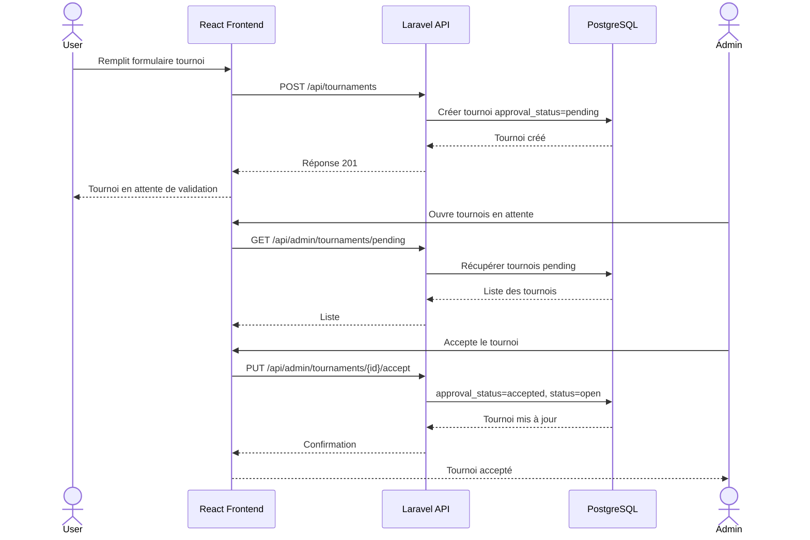
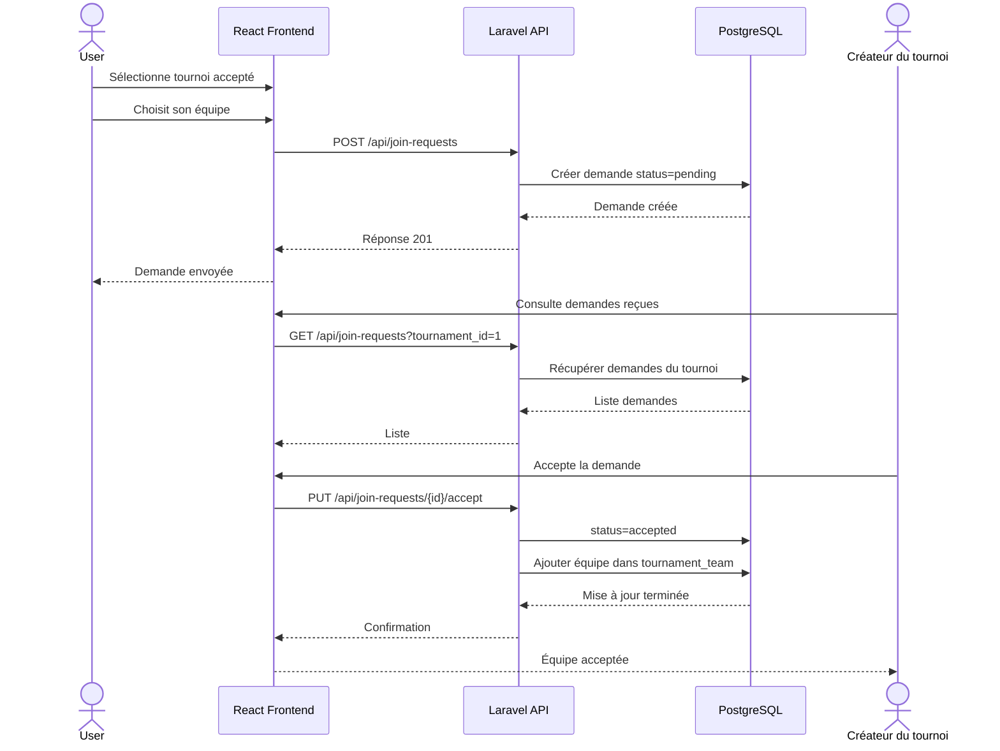
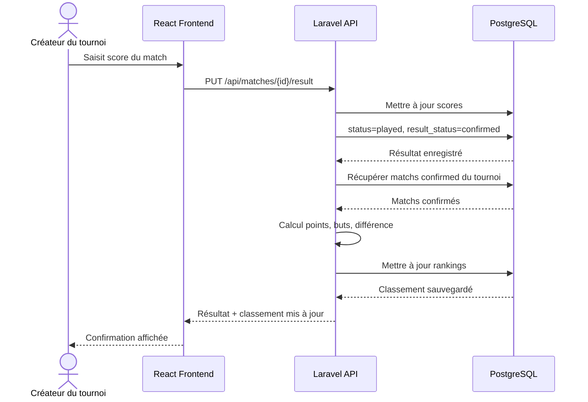
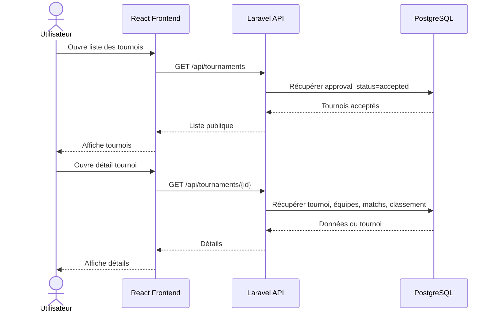

# Diagrammes de Séquence — Gestion Tournois Locaux

## 1. Création et validation d'un tournoi

## 2. Demande de participation d'une équipe

## 3. Saisie du résultat et recalcul du classement

## 4. Consultation publique d'un tournoi

