# Diagramme de Cas d'Utilisation — Gestion Tournois

## 1. Objectif

Ce diagramme présente les principales fonctionnalités de la plateforme Gestion Tournois et les acteurs qui interagissent avec le système.

L'application permet de gérer à la fois des compétitions officielles et des compétitions locales créées par les utilisateurs.

---

## 2. Acteurs

### Admin

L'admin gère la plateforme complète. Il peut gérer les utilisateurs, les compétitions officielles, les résultats officiels, les paiements simulés et les publications.

### Organizer

L'organizer crée et gère ses propres compétitions locales après activation de son compte par paiement simulé.

### Team Manager

Le team manager crée une équipe, ajoute les joueurs et demande la participation à des compétitions locales.

### Viewer / Fan

Le viewer consulte les informations publiques : compétitions, matchs, résultats, classements, statistiques et publications.

---

## 3. Cas d'utilisation

### Cas communs

- S'inscrire
- S'authentifier
- Consulter les compétitions
- Consulter les matchs
- Consulter les résultats
- Consulter les classements
- Consulter les statistiques
- Consulter le feed football

### Admin

- Gérer les utilisateurs
- Gérer les saisons
- Gérer les compétitions officielles
- Gérer les championnats officiels
- Gérer les tournois officiels
- Planifier les matchs officiels
- Saisir les résultats officiels
- Gérer les paiements simulés
- Superviser les publications

### Organizer

- Simuler le paiement d'abonnement
- Créer un championnat local
- Créer un tournoi local
- Gérer ses compétitions locales
- Gérer les demandes de participation
- Accepter ou refuser une équipe
- Planifier les matchs locaux
- Saisir les résultats locaux
- Valider un résultat local
- Publier une annonce

### Team Manager

- Créer une équipe
- Gérer les joueurs de son équipe
- Demander la participation à une compétition locale
- Consulter ses demandes
- Confirmer un résultat
- Contester un résultat

### Viewer / Fan

- Voir les compétitions officielles
- Voir les compétitions locales
- Filtrer par ville, niveau, date ou type
- Voir les matchs du jour
- Voir les derniers résultats
- Voir les classements
- Voir les statistiques

---

## 4. Diagramme

```mermaid
flowchart LR
    Admin[Admin]
    Organizer[Organizer]
    Manager[Team Manager]
    Viewer[Viewer / Fan]

    UC1((S'inscrire / S'authentifier))
    UC2((Gérer les utilisateurs))
    UC3((Gérer les saisons))
    UC4((Gérer les compétitions officielles))
    UC5((Créer une compétition locale))
    UC6((Simuler paiement organizer))
    UC7((Créer / gérer équipe))
    UC8((Gérer les joueurs))
    UC9((Demander participation))
    UC10((Accepter / refuser demande))
    UC11((Planifier les matchs))
    UC12((Saisir les résultats))
    UC13((Confirmer / contester résultat))
    UC14((Valider résultat local))
    UC15((Générer classement))
    UC16((Consulter résultats))
    UC17((Consulter classements))
    UC18((Consulter statistiques))
    UC19((Publier post / annonce))
    UC20((Consulter feed football))
    UC21((Gérer paiements simulés))

    Admin --> UC1
    Admin --> UC2
    Admin --> UC3
    Admin --> UC4
    Admin --> UC11
    Admin --> UC12
    Admin --> UC15
    Admin --> UC19
    Admin --> UC21

    Organizer --> UC1
    Organizer --> UC6
    Organizer --> UC5
    Organizer --> UC10
    Organizer --> UC11
    Organizer --> UC12
    Organizer --> UC14
    Organizer --> UC15
    Organizer --> UC19

    Manager --> UC1
    Manager --> UC7
    Manager --> UC8
    Manager --> UC9
    Manager --> UC13

    Viewer --> UC1
    Viewer --> UC16
    Viewer --> UC17
    Viewer --> UC18
    Viewer --> UC20
```

---

## 5. Remarque

L'admin possède les droits globaux. L'organizer gère uniquement ses propres compétitions locales. Le team manager gère son équipe et ses demandes. Le viewer possède seulement des droits de consultation.
