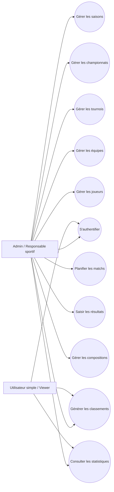

# Diagramme de Cas d'Utilisation — Gestion Tournois

## 1. Objectif

Ce diagramme présente les principales fonctionnalités de l'application et les acteurs qui interagissent avec le système.

## 2. Acteurs

### Admin / Responsable sportif

L'admin est l'acteur principal. Il peut gérer toutes les données sportives.

### Utilisateur simple / Viewer

L'utilisateur simple peut consulter les informations publiques : équipes, matchs, classements et statistiques.

## 3. Cas d'utilisation

- S'authentifier
- Gérer les saisons
- Gérer les championnats
- Gérer les tournois
- Gérer les équipes
- Gérer les joueurs
- Planifier les matchs
- Saisir les résultats
- Gérer les compositions d'équipes
- Générer les classements
- Consulter les statistiques

## 4. Diagramme

## 5. Remarque

L'admin possède les droits de gestion, tandis que l'utilisateur simple possède seulement des droits de consultation.