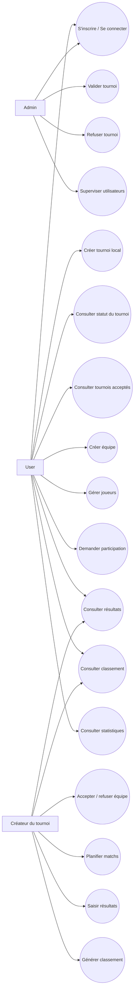

# Diagramme de Cas d'Utilisation — Gestion Tournois Locaux

## 1. Objectif

Ce document présente les principales fonctionnalités de l'application **Gestion Tournois Locaux** et les acteurs qui interagissent avec le système.

L'application permet uniquement la gestion des tournois locaux de football.

## 2. Acteurs

### Admin

L'admin valide ou refuse les tournois créés par les utilisateurs. Il supervise la plateforme.

### User

L'utilisateur peut créer un tournoi local, créer une équipe, ajouter des joueurs, demander la participation à un tournoi et consulter les résultats.

### Créateur du tournoi

Le créateur du tournoi est un utilisateur qui possède des droits de gestion uniquement sur les tournois qu'il a créés.

## 3. Cas d'utilisation

### Cas communs

- S'inscrire.
- Se connecter.
- Consulter les tournois acceptés.
- Consulter les matchs.
- Consulter les résultats.
- Consulter les classements.
- Consulter les statistiques.

### Admin

- Consulter les tournois en attente.
- Accepter un tournoi.
- Refuser un tournoi.
- Ajouter une note d'administration.
- Superviser les utilisateurs.

### User

- Créer un tournoi local.
- Consulter le statut de validation de son tournoi.
- Créer une équipe.
- Ajouter des joueurs.
- Envoyer une demande de participation.
- Consulter ses demandes.

### Créateur du tournoi

- Gérer son tournoi.
- Consulter les demandes de participation.
- Accepter ou refuser une équipe.
- Planifier les matchs.
- Saisir les résultats.
- Générer le classement.

## 4. Diagramme



## 5. Remarque

Le rôle `Créateur du tournoi` n'est pas un rôle stocké dans `users.role`. C'est une permission logique basée sur la règle :

```txt
tournament.created_by == current_user.id
```
